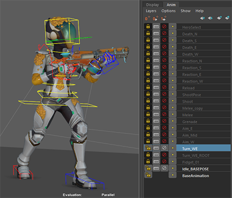
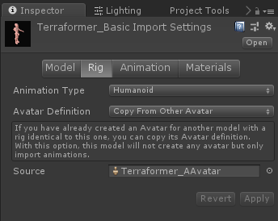
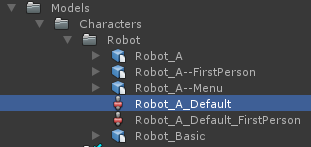
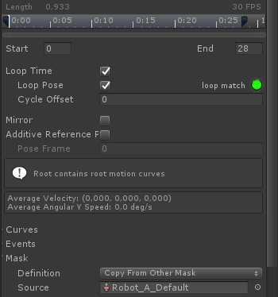

# Animation Content Pipeline
Authoring, Export, Import

### Iteration
We assume an iterative workflow where animations are put into game in their earliest/mockup inceptions and continuously 
updated as the projects progresses, bug surface and standards change late in production.

### Authoring
Animation is done in Maya. A Maya scene typically contains a grouping of related animations, for instance all animations
for the Stand State.

From here a separate clip is exported for each animation, with the help of a custom exporter. Splitting each animation 
into multiple exports allow for quick export and import times. E.G:

> //sample_game/prototype01/main/ProjectFolder/Assets/Animation/Characters/Terraformer/Clips/Locomotion--Run_N.anim.fbx
> //sample_game/prototype01/main/ProjectFolder/Assets/Animation/Characters/Terraformer/Clips/Locomotion--Run_S.anim.fbx

### Humanoid and Generic
We use both Humanoid and Generic for our characters, which let’s us exercise and show both pipelines:

* Humanoid for Third Person - where you might want to share animation between characters.
* Generic for First Person - which is relative to camera and likely very specific to the skeleton you are using
* Generic for Menu and Cinematic sequences

The use of translation driven squash and stretch (TranslateScale Component) allow for non- uniform scale to be used 
with Generic as well as with Humanoid/Re-targeting.

### Avatars
We aim to define the Avatar for a Skeleton once (well once for Humanoid and once for Generic) and let any subsequent 
model and animation FBX’s copy this avatar:

Currently all Avatars copies must be updated if the source Avatar changes. Here is a small script that will accomplish 
that: 

> Menu -> fps.sample -> Animation -> Update Avatar References

### Avatar Masks
We use Avatar Masks for all our animations for a few reasons:

* Only generate animation curves for relevant bones.
* Generate curves for Generic bones when using Humanoid (these are masked out by default when no mask is used).

As with Avatars, we assume a single default mask will be used for all Clips, unless a special case mask is needed. 
So we use the copy from option:

If the source mask changes it must be updated in all dependent clips, so there's a button for that:

> Menu -> fps.sample -> Animation -> Update Avatar Masks`

### Import AssetPostProcessor
`AnimationImport.cs`

An AssetPostProcessor is used during animation import, which does just a few things:

* We have a lot of fast movement in our game, so we over sample Humanoid animations by a factor 2. This will allow the resulting 
Muscle clips to better represent the original motion and we in turn rely on compression to throw away the keys that are not needed.
* We force the length of any Clip that is present in the FBX (matched by name) to the frame range in the file. 

### Humanoid Configuration
Humanoid has the option of Leg and Arm stretch (Anti pop/Soft IK), which will slight lengthen the bones as they reach 
full extension, which can be especially useful during retargeting to avoid IK pops. This can however have the side effect, 
that arm and legs may never fully straighten the way they do in the source animation.

With our choice of animation style and having almost purely character specific animations, turning this feature off made the most sense. 

# Animation Implementation

## Third Person Animation

Making network synchronised animation for a server authoritative multi player shooter, puts specific constraints on how we 
implement animation. We need to handle things like replication, rollback, prediction and lag compensation.

For this reason we have chosen to use a custom Playable Graph, rather than using the Animator Controller for third person.

#### Playable Graph
The playable graph is the backend for animation features like TimeLine and the Animator Controller. When you use these 
a playble graph is created in the background. 

These Playble Graphs can be visualized using the Playable Graph Visualizer

In Sample Game our playable graphs mainly consist of __AnimationClips__, __Animation Mixers__ and __AnimationScriptPlayables__.

#### Animation Templates
Animation Templates is our way defining pieces of animation network (sub graphs). These are typically hooked together to 
form a larger network.

A Template includes:

* A settings Scriptable Object.
* Code to build out the sub graph and connect it to any parent or child sub graphs.
* Code that controls the state of the network & reads/writes replicated properties 
(are we turning, how far into the turn are we, phase of the current animation etc.)
* Code the reads the replicated state and applies it to actual playable nodes (mixer weight, clip time, foot ik enabled etc.)

To create an instance of an animation template, right click in the asset browser and select:
> Create->Sample Game->Animation->AnimGraph->Template

Animation Templates for a third person character

Sprint Template Inspector

Sub graph created from the Sprint Template highlighted. It consists of 4 animation clips, 1 regular and 1 layer mixer.

### State Machine: Animation State Selector Template 
A key Animation Template is `AnimGraph_StateSelector`. It acts as a state machine and maps child 
templates/sub graphs to character animation states and blends between them.

> E.G: //sample_game/prototype01/main/ProjectFolder/Assets/Animation/Characters/Terraformer/AnimationSets/AnimStateSelector.asset

Each state has a default blend time from other states, with the possibility of defining custom transition times from other states

###  Animation Stack
The `AnimGraph_Stack` is currently used as the root Animation Template of our characters graphs. Here we can
assign templates to be chained together in serial fashion.

> E.G: //sample_game/prototype01/main/ProjectFolder/Assets/Animation/Characters/Terraformer/AnimationSets/AnimGraph.asset

###  Assigning the Animation Graph to a Character
To assign an Animation Template as a root template for a character, assign it to the `AnimStateController` in the 
Characters Prefab.

## First Person Animation

First person is local to the client, which means no multi player constraints, so here we've used the Animator Controller

> //sample_game/prototype01/main/ProjectFolder/Assets/Animation/Characters/Robot_1P/AnimatorControllers/Robot.controller

Characters and weapon are seperated hierachies, but need to play the same animations, so an override controller is 
used for the weapon animation

> //sample_game/prototype01/main/ProjectFolder/Assets/Animation/Characters/Robot_1P/AnimatorControllers/Robot_Weapon.overrideController

### Assigning the First Person Controller

Animator Controllers are not assigned directly to the Animator, but assigned to an Animator Controller Template 
(`AnimGraph_AnimatorController`), which handles forwarding of game state to the Animator Controllers parameters. 

> E.G: //sample_game/prototype01/main/ProjectFolder/Assets/Animation/Characters/Terraformer_1P/AnimationSets/Controller_Character.asset

This is in turn assigned to an Animation State (AnimGraph_Stack) which also let's us add so additional nodes, 
like Off Hand IK and Aim Drag.

This Animation Template is assigned to the `AnimStateController` of the First Person Characters Prefab

 
## Animation Jobs
Animation Jobs/Animation Script Playables are used for custom nodes that read and write to the animation stream. Examples are:

* Offhand IK (Generic Stream)
* Foot IK while standing (Humanoid Stream)
* First Person Weapon Drag/Lead (Generic Stream)
* Banking (Humanoid Stream)