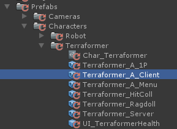
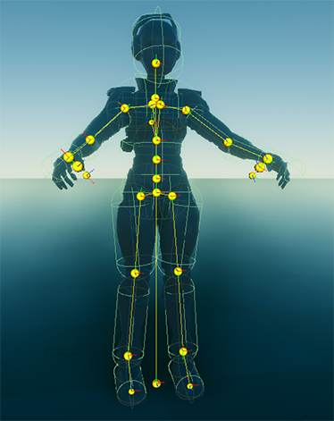
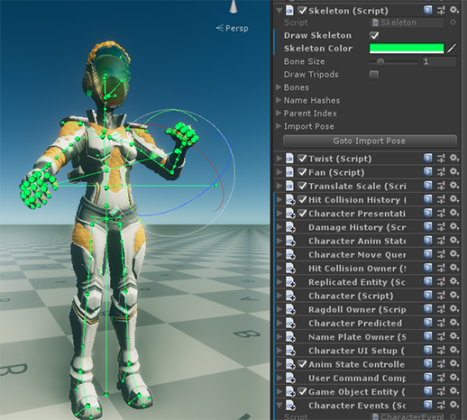
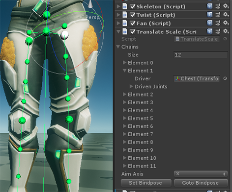

# Character Pipeline

### Iteration
We assume an iterative workflow where characters are put into game in their earliest/mockup inceptions and continuously updated as the projects progresses, bug surface and standards change late in production.

### Authoring
Characters are Modeled and Rigged in Maya and exported into FBX files.

> E.G: //sample_game/prototype01/main/ProjectFolder/Assets/Models/Characters/Terraformer/Terraformer_A.fbx

### Prefabs
Prefab are where Materials are assigned and additional components for game play systems are added and configures. We use Prefab Variants as they allow the prefab to stay up to date as mesh, skeleton and skinning changes throughout production.

We have different prefabs for each character, like first person, client, server, hit collision and ragdoll. A simplified version of the characters skeleton is used where appropriate:

### Skeleton Component
The Skeleton Component stores information about the characters bone hierarchy, bone names and default pose for quick lookup at runtime. It also lets you visualize and interact with the skeleton in the scene view.

It’s added during import, in order to stay in sync with the model.fbx. Placing skeleton root nodes below a transform/group called “Skeleton” that is a child of the prefab root, will let the skeleton be picked up correctly by the AssetPostProcessor: 

> //sample_game/prototype01/main/ProjectFolder/Assets/Scripts/EditorTools/Editor/SkeletonImporter.cs.

### Procedural Bones
Procedural bone components (Twist, Fan and TranslateScale) help with deformations and also allow for Squash and Stretch like behaviors. They are added on import, based on markup saved in custom attributes on the skeleton when the rig is built in Maya:

> //sample_game/prototype01/main/ProjectFolder/Assets/Scripts/EditorTools/Editor/SkeletonImporter.cs.

Data about procedural bone setup is stored in MonoBehaviors. These also drive the bones in edit mode, so you may interact with the characters skeleton and see the behaviour of the procedural bones.
> E.G: //sample_game/prototype01/main/ProjectFolder/Assets/Scripts/Game/Systems/Character/Components/TranslateScale.cs

When the game is running they are instead driven in systems in LateUpdate using C# jobs and Burst. 
> E.G: //sample_game/prototype01/main/ProjectFolder/Assets/Scripts/Game/Systems/Character/TwistSystem.cs

For performance reasons procedural bones are not updated on the server.

### A work in progress
The project and pipeline is a work in progress and there are plenty of things for us to tackle still. Could be facial animation, powered ragdoll, weapon and character dynamics driven with shaders or animation jobs and much more.

### Humanoid Configuration
A Stance Pose that is parallel to world coordinates, without bends in in arms and knees is used for best results. 

Additional Settings:
* Twist extraction is disabled as we use our own twist solution with dedicated twist bones.
* Translation DoF (Degrees of freedom) is enabled to allow for translation based stretch.

